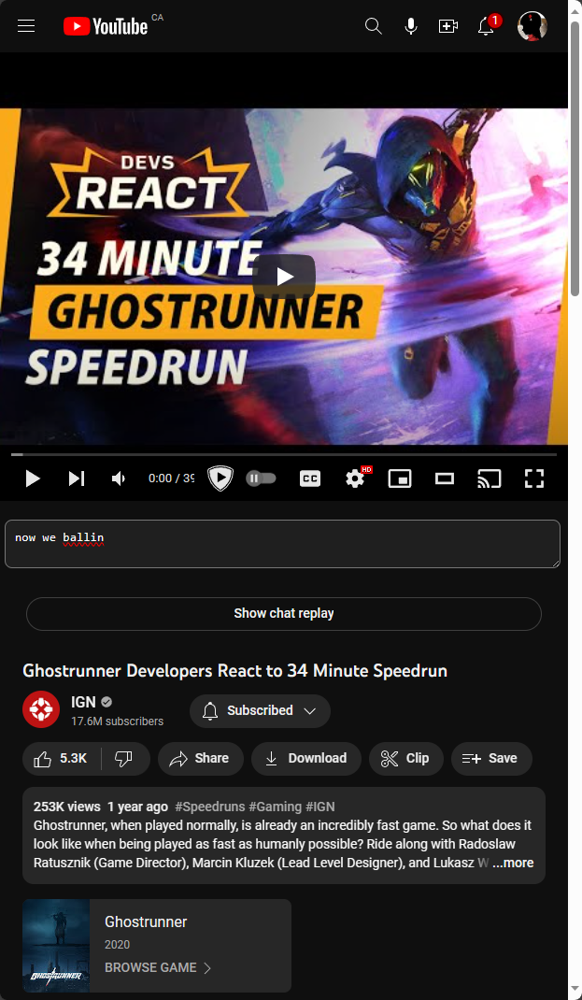

# Onboarder

A tool that makes it easy to take notes on YouTube videos.

<!-- https://youtu.be/yRQ3huqRS2o?list=RDDpN_bXzwsV8&t=1021 before this timestamp -->
https://github.com/TeamDman/Onboarder/assets/9356891/115300db-f5c1-403a-a86f-3969bf898748

Browser:  

File on disk:   

## TODO:

- Load note content on page load
- HTTPS
- Auth; ensure requests are from the browser and nowhere else for now
- Anti-clobber strategy